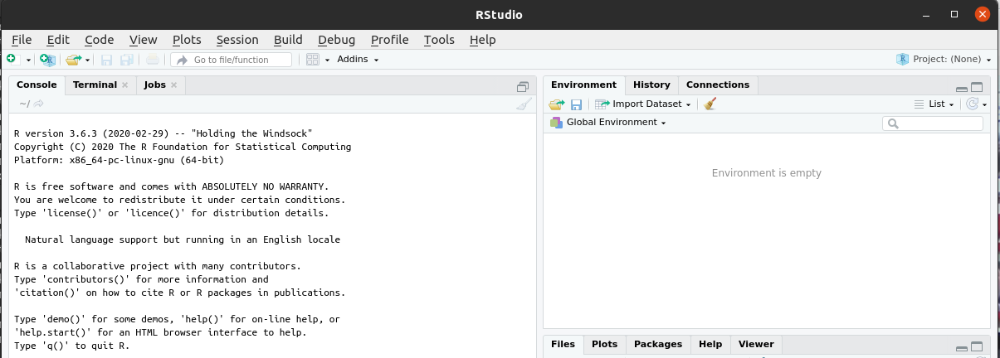

# R in Java


# Requires

* Java 8+


```
apt install r-cran-rjava
```


As root

```
R CMD javareconf
```

Install

```
install.packages("rJava")
```


Loaded

```
require(rJava)
Loading required package: rJava
```

```
.jinit()
v <- new (J("java.lang.String"), "Hello World!")
```

```
print(v)
[1] "Java-Object{Hello World!}"
```

Getting tmpDir from Java
```
tmpDir <- .jcall("java/lang/System","S","getProperty","java.io.tmpdir")
```

```
print(tmpDir)
[1] "/tmp"
```

# RStudio

Ubuntu 20.04 tested

Key

```
gpg --keyserver keys.gnupg.net --recv-keys 3F32EE77E331692F

sudo apt install r-base libclang-dev
wget https://download1.rstudio.org/desktop/bionic/amd64/rstudio-1.2.5042-amd64.deb
sudo dpkg -i rstudio-1.2.5042-amd64.deb
rm rstudio*.deb
```

Then

```
rstudio
```



# Database

H2

```
install.packages("RH2")
```

```
library(RH2)
con <- dbConnect(H2())
s <- 'create table tt("id" int primary key, "name" varchar(255))'
dbSendUpdate(con, s)
dbSendUpdate(con, "insert into tt values(1, 'Hello')")
dbSendUpdate(con, "insert into tt values(2, 'World')")
dbGetQuery(con, "select * from tt")
```

```
  id  name
1  1 Hello
2  2 World
```


# References

[RStudio](https://rstudio.com/products/rstudio/download/)

[R in Java](http://www.oracle.com/technetwork/java/jvmls2013vitek-2013524.pdf)

[jcall](https://www.rforge.net/doc/packages/rJava/jcall.html)

[RStudio Install](https://linuxconfig.org/install-r-on-ubuntu-18-04-bionic-beaver-linux)

[RH2](https://cran.r-project.org/web/packages/RH2/index.html)

